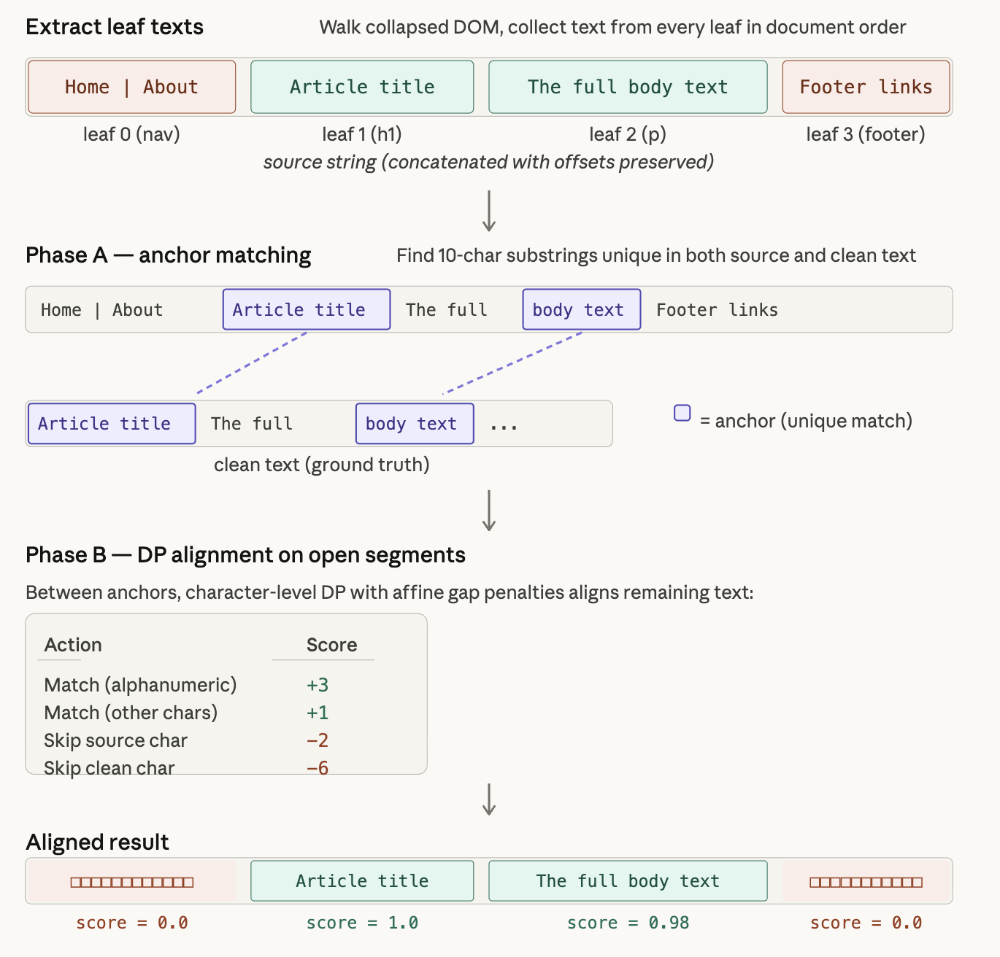

# web2textpy

Python reimplementation of the [Web2Text](https://github.com/dalab/web2text) pipeline for labeling HTML DOM nodes as **content** or **boilerplate** using paired `(raw_html, clean_text)` data.

## Installation

```bash
uv add web2textpy
```

## Quick Start

```python
from datasets import load_dataset
from web2text import run_pipeline

ds = load_dataset("williambrach/html-boilerplate-labeled", split="test")
row = ds[0]

tree, extracted_text, metrics = run_pipeline(row["html"], row["text"])

print(extracted_text[:200])
print(metrics)
```

## Step-by-Step API

Each stage of the pipeline is exposed as a standalone function:

```python
from web2text import build_cdom, extract_leaves, align, label_nodes, extract_text, evaluate

# 1. Parse HTML into a collapsed DOM tree
tree = build_cdom(html_string)

# 2. Extract ordered text-bearing leaf nodes
leaves = extract_leaves(tree)  # [(element, "normalized text"), ...]

# 3. Align leaf texts against ground-truth clean text
scores = align(leaves, clean_text)  # {leaf_id: 0.0-1.0 match score}

# 4. Label each node as "content" or "boilerplate"
tree = label_nodes(tree, scores, threshold=0.667)

# 5. Extract text from content-labeled nodes
result = extract_text(tree)

# 6. Evaluate against ground truth
metrics = evaluate(result, clean_text)
# => {'token_f1': 0.99, 'precision': 0.99, 'recall': 0.99, 'rouge1_f': 0.99, 'bleu': 98.5, 'chrf': 98.8}
```

## How the Matching Algorithm Works

Given raw HTML and its known clean text, the algorithm determines which DOM nodes are content versus boilerplate in six steps:

1. **Simplify the DOM** — strip non-content tags (`<script>`, `<style>`, etc.) and collapse single-child chains into a Collapsed DOM (CDOM) representation
2. **Collect leaf text** — walk the CDOM, concatenate text from every leaf node into one source string with tracked character offsets
3. **Find anchors** — identify 10-character substrings that appear exactly once in both the source and clean text, splitting the problem into independent segments
4. **DP alignment** — for each segment between anchors, run character-level dynamic programming with affine gap penalties to map source characters to clean-text characters
5. **Score leaves** — map alignment results back to leaf boundaries via stored offsets, giving each leaf a score: `matched_chars / total_chars`
6. **Label nodes** — leaves scoring above `0.667` are labeled `"content"`, the rest `"boilerplate"`, with labels propagating upward to parents




## Dataset

Dataset: [williambrach/html-boilerplate-labeled](https://huggingface.co/datasets/williambrach/html-boilerplate-labeled) — ~4k pages from CleanEval, Dragnet, CETD, Readability, and others (3,985 pages total).

| Source             | Train (ROUGE-1 F) | Test (ROUGE-1 F) |
|--------------------|-------------------|------------------|
| readability        | 0.993 (92)        | 0.997 (23)       |
| scrapinghub        | 0.991 (145)       | 0.996 (36)       |
| cetd               | 0.993 (560)       | 0.987 (140)      |
| google-trends-2017 | 0.986 (144)       | 0.995 (36)       |
| cleanportaleval    | 0.985 (57)        | 0.971 (14)       |
| cleaneval          | 0.985 (590)       | 0.991 (148)      |
| dragnet            | 0.983 (1,103)     | 0.983 (276)      |
| l3s-gn1            | 0.920 (497)       | 0.927 (124)      |
| **Overall**        | **0.976** (3,188)  | **0.978** (797)  |

>Sample counts in parentheses.

## Original Work

- **Paper**: Vogels et al., "Web2Text: Deep Structured Boilerplate Removal" (ECIR 2018) — [arxiv.org/abs/1801.02607](https://arxiv.org/abs/1801.02607)
- **Original implementation** (Scala): [github.com/dalab/web2text](https://github.com/dalab/web2text)
